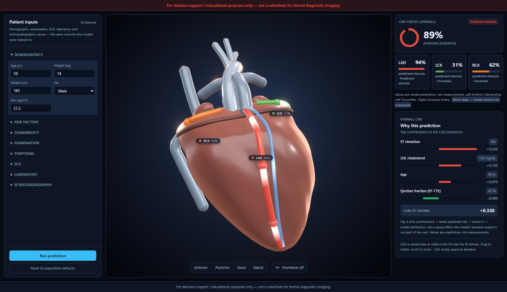

# CardioScope — Interactive 3D Cardiovascular Risk Visualisation

**Track A · Multimodal AI Hackathon 2026 · Team of 4 (M1–M4)**
Source: <https://github.com/vaibhavitej-a11y/CardioScope>

> **For decision support / educational purposes only — not a substitute for
> formal diagnostic imaging.**

## 1. Overview

CardioScope predicts **overall CAD status** and **predicted stenosis
probability** for the three major coronary arteries (LAD, LCX, RCA) from 54
routine clinical features, then maps those predictions onto an interactive 3D
heart: each vessel is colour-ramped by its predicted risk, selectable for a
detail view, and explained with SHAP contributions. The system answers two
questions a table of numbers cannot: *how sick is this patient* and *where is
the risk* — in one screen.

**Architecture.** Three layers, one repo:

| Layer | Tech | Role |
|---|---|---|
| `ml/` | Python, scikit-learn, LightGBM/XGBoost/CatBoost, SHAP | 4 binary classifiers + tests |
| `api/` | FastAPI (connected; port 8001) | `POST /api/predict` |
| `web/` | React 19, TypeScript, Vite, React Three Fiber 9, Zustand, Tailwind 4 | form, 3D viewer, dashboard |

Data flow: *patient form → Zustand store → typed API client → (model
response) → dashboard + 3D colouring*. The client also has a documented mock
mode that returns a canned worked example through the identical types, so
the UI can run offline for demos — the shipped flag talks to the live
service.

## 2. Dataset & preprocessing

| | |
|---|---|
| Source | UCI ML Repository id **411**, *Extension of Z-Alizadeh Sani* |
| DOI / licence | 10.24432/C5461K · CC BY 4.0 (unmodified file ships in repo) |
| Size | **303 patients × 59 columns, 0 missing values** |
| Targets | `Cath` (CAD), `LAD`, `LCX`, `RCA` — binary labels |

`ml/src/data.py` is the single entry point:

1. **Typed columns.** Numeric vs categorical is decided by explicit lists, not
   dtype guessing (`Region RWMA` is forced categorical — it is a region
   *label*, never a coordinate).
2. **Constant columns dropped.** `Exertional CP` is identical for all 303
   patients → zero information. 59 − 4 targets − 1 constant = **54 model
   features** — the same 54 shown in the UI form.
3. **Targets mapped** to 1/0 with unknown-label guards (any unexpected string
   fails loudly).
4. **Target-leakage guard.** `Cath`, `LAD`, `LCX`, `RCA` are *excluded from
   every model input* — they are the answers (what the catheter found), not
   features. Enforced by `ml/tests/test_leakage.py`; UCI's own dataset note
   requires the same.

**Preprocessing pipeline** (inside each model's `Pipeline`, so train/serve
cannot diverge): numeric → median impute → standard scale (logistic baseline);
categorical → most-frequent impute → one-hot with `handle_unknown="ignore"`.

## 3. Model architecture & training

Four **independent binary classifiers**, one shared preprocessing pattern
(decision D6):

- **Candidates:** LightGBM, XGBoost, CatBoost (`class_weight` /
  `auto_class_weights="balanced"` — n = 303, class imbalance handled by
  weights, not resampling) + a **logistic-regression baseline** reported for
  context.
- **Selection:** best mean **ROC-AUC** on **5-fold stratified CV**, seed 42.
- **No held-out test set** — 303 rows is too few to waste; every metric is
  either mean ± std over the 5 folds or pooled out-of-fold (each patient
  predicted exactly once).
- **Operating point:** each outer training split picks its threshold on an
  inner 3-fold CV (maximising F1) so the validation fold never tunes its own
  cut-off. Production threshold = max-F1 on pooled OOF (e.g. Cath 0.27, LAD
  0.35, LCX 0.26, RCA 0.08). Tuning **raises recall for screening** —
  recorded separately, never mixed with default-0.5 numbers.
- **Explainability:** SHAP `TreeExplainer` per selected tree model
  (requirement 3b allows SHAP *or* LIME; decision D5: SHAP only).
- **Artifacts:** joblib bundle per target + `metrics.json` + SHAP report,
  rewritten by `python ml/src/train.py` in ~70 s, versioned with git commit.

## 4. Evaluation results

5-fold stratified CV, seed 42, pooled out-of-fold, 0.5 threshold unless noted:

| Target (model) | ROC-AUC (CV mean ± sd) | OOF accuracy | OOF precision | OOF recall | OOF F1 | Recall @ tuned cut-off |
|---|---|---|---|---|---|---|
| **Cath / CAD** (CatBoost) | **0.913 ± 0.052** | 0.855 | 0.887 | 0.912 | **0.900** | 0.949 |
| **LAD** (CatBoost) | **0.847 ± 0.047** | 0.782 | 0.797 | 0.842 | **0.819** | 0.904 |
| **LCX** (XGBoost) | 0.743 ± 0.065 | 0.683 | 0.604 | 0.563 | 0.583 | 0.824 |
| **RCA** (CatBoost) | 0.704 ± 0.050 | 0.660 | 0.558 | 0.465 | 0.507 | 0.860 |

Context: the logistic-regression baseline reaches ROC-AUC 0.925 on Cath —
slightly above CatBoost's 0.913 within noise — but tree models were kept
because the interpretability requirement is served by `TreeExplainer`.
**LCX and RCA are the genuinely hard targets** (fewer positives, subtler
signal); we report them at face value rather than hiding them behind
threshold tricks. Full per-fold numbers: `ml/artifacts/metrics.json`.

## 5. Interactive 3D pipeline

Requirement 2a allows Three.js / R3F / VTK.js and *permits* open-source meshes
without requiring them; decision D1 kept the anatomy **fully procedural** —
zero downloaded assets, so the viewer works offline and stays under the
no-GPU budget.

- **Geometry (`web/src/vessels.ts`, `Heart.tsx`).** The heart is one lathe
  profile (96 segments, two-octave surface grain) with a shared tilt applied
  to every child so muscle, coronaries and labels can never drift apart.
  LAD/LCX/RCA are tube geometries swept along anatomically placed curves that
  ride the sulcus grooves; nine clickable node markers satisfy the literal
  "coronary artery nodes" wording (decision D3); auricles, aorta, pulmonary
  trunk, venae cavae, the great cardiac vein and coronary sinus complete the
  silhouette.
- **Materials (`materials.ts`).** Shared physical materials with a fresnel
  rim injected via `onBeforeCompile`, procedural roughness + bump tissue map,
  clearcoat + emissive glow on the vessels; an IBL environment built from
  local lightformers (nothing fetched), warm back-rim key light, a deep
  midnight radial backdrop, bloom + vignette in a lightweight post-process
  chain.
- **Motion.** A systole contraction (radial bulge ≈ 2× long-axis, torsional
  sway) runs in one `useFrame`; toggleable from the UI. Travelling light
  bands scroll base-to-apex along LAD/LCX/RCA and the venous return — an
  emissive pulse injected into the physical shader, so blood visibly flows
  without particles.
- **Risk mapping.** Each vessel's colour ramp and node colour are driven by
  the predicted probability shared through the store — green-amber-red is
  reserved for risk only. Labels (e.g. "LAD 94%") render as DOM pills anchored
  to 3D positions via a portal.
- **Interaction.** Orbit, zoom, click tube/node to select (second click
  clears), four camera presets (Anterior/Posterior/Basal/Apical), and one
  detail panel scoped to the selection — what the vessel supplies plus its
  SHAP drivers next to the patient's measurements, shown once.
- **Performance.** DPR capped at 1.75, low-poly geometry, single render loop,
  no external textures — responsive in a modern browser without a dedicated
  GPU.



*Figure 1 — CardioScope in use: the 54-feature patient form (left), the
interactive 3D heart with vessel risk labels, selection and camera presets
(centre), and the prediction dashboard with CAD status, per-vessel predicted
stenosis probability and SHAP explanation (right).*

## 6. Clinical dashboard & explanation

Beside the canvas (requirement 3): a CAD status card with predicted
probability as a donut gauge, three vessel cards (LAD/LCX/RCA with predicted
stenosis probability and band), and a single explanation panel — "why this
prediction" — where each top contribution appears once, pairing the feature
with the patient's measurement, its signed contribution and a direction bar.
Selecting a vessel in 3D reframes that same panel to the vessel (what it
supplies plus its drivers); the probabilities stay in the cards, never
repeated. Missing inputs display "—" rather than invented values.
Disclaimers appear as a startup modal, a persistent banner and a page footer
(requirement 5).

## 7. Getting started

```powershell
git clone https://github.com/vaibhavitej-a11y/CardioScope.git
cd CardioScope
python -m venv .venv
.venv\Scripts\activate
pip install -r requirements.txt
cd web && npm install && cd ..

python ml/src/train.py                  # trains 4 models, writes ml/artifacts/
npm --prefix web run dev                # frontend → http://localhost:5173
cd api && uvicorn app.main:app --reload --port 8001   # → :8001/docs
```

Prerequisites: Python ≥ 3.11, Node ≥ 20.19, Git. Verification:

```powershell
npm --prefix web run lint        # oxlint — clean
npm --prefix web run build       # tsc -b && vite build — passing
python -m pytest                 # ml + api — 38/38
```

## 8. Safety, honesty & reproducibility

- Disclaimer text is enforced in one place (`api/app/constants.py`) and
  rendered in modal + banner + footer.
- We only claim **predicted probabilities**; the dataset contains no lesion
  coordinates, so the UI never presents pixel-level lesion mapping — vessel
  granularity is the resolution the data supports (decision D4).
- Leakage is blocked by tests, not conventions; seeds are fixed (42); model
  selection, thresholds and variance are all recorded in machine-readable
  artifacts; the raw dataset file is committed unmodified with CC BY 4.0
  attribution.

## 9. Limitations & future work

- **LCX / RCA discrimination is modest** (ROC-AUC ≈ 0.74 / 0.70). These are
  few-positive, subtle-signal targets in a 303-row dataset; we report them at
  face value. More data or richer inputs would help more than tuning.
- **The prediction service is local-only** (FastAPI, `api/`); it is wired to
  the UI in development via the Vite proxy, and the typed mock client
  remains as a one-flag offline fallback (decision D8).
- **Local-only execution** (decision D8) — no hosted deployment; the Devpost
  requirement is a public repo, not a live URL.
- **The anatomy is schematic**, not patient-specific morphology, and the
  dataset carries no lesion coordinates — so predictions map to *vessels*, not
  to positions along a vessel (decision D4).
- **Future work:** calibration curves, prospective validation, imaging
  modalities as inputs, and torso context (decision D2 — stretch).

*CardioScope — decision support and education only; not a substitute for
formal diagnostic imaging.*
